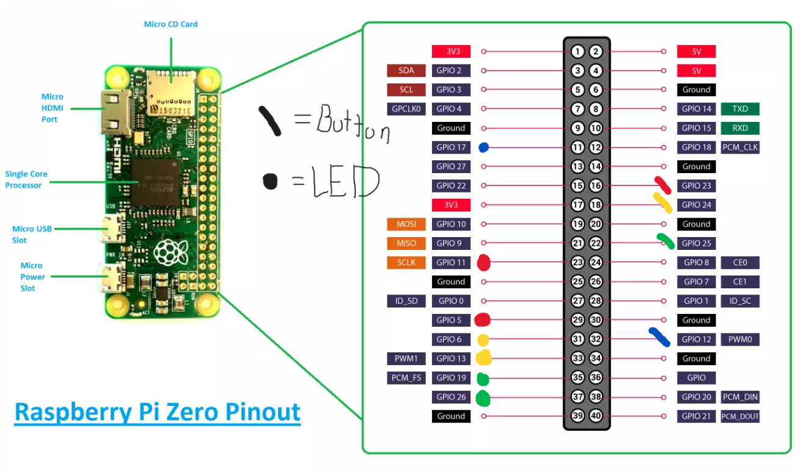
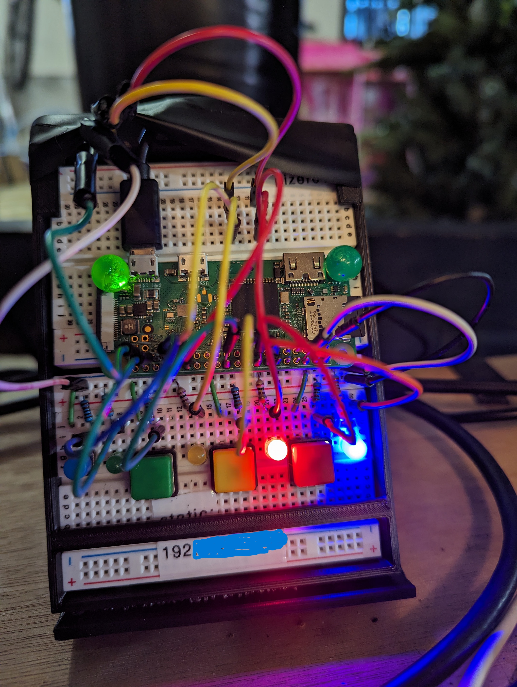

# Office Stoplight


## Project Decription

I work from home, and my workspace also happens to directly attatch to the garage. Because of this, my family often needs access to the garage, but does not know if I can be disturbed. This system will give them a definitive answer, by placing adjustable LEDs on the outside of the office and garage doors.

Please feel free to use everything here to build your own.

## Hardware

### Pre-requisites:

1. You will need to set up a Raspberry Pi. **[Click Here for Instructions](https://github.com/DavidMiles1925/pi_zero_setup)**

### Components List

NOTE: I used some larger LEDs for the "above door" unit, but that is optional.

| Item                 | Quantity | Link                                                                                                   |
| -------------------- | -------- | ------------------------------------------------------------------------------------------------------ |
| Raspberry Pi Zero    | 1        | [Microcenter](https://www.microcenter.com/product/643085/raspberry-pi-zero-2-w)                        |
| Red LEDs             | 2        | [Amazon](https://www.amazon.com/gp/product/B07QXR5MZB/ref=ppx_yo_dt_b_search_asin_title?ie=UTF8&psc=1) |
| Yellow LEDs          | 2        | [Amazon](https://www.amazon.com/gp/product/B07QXR5MZB/ref=ppx_yo_dt_b_search_asin_title?ie=UTF8&psc=1) |
| Green LEDs           | 2        | [Amazon](https://www.amazon.com/gp/product/B07QXR5MZB/ref=ppx_yo_dt_b_search_asin_title?ie=UTF8&psc=1) |
| BLue LED             | 1        | [Amazon](https://www.amazon.com/gp/product/B07QXR5MZB/ref=ppx_yo_dt_b_search_asin_title?ie=UTF8&psc=1) |
| 1KΩ Resistors        | 3        | [Amazon](https://www.amazon.com/gp/product/B07ZX2CB6B/ref=ppx_yo_dt_b_search_asin_title?ie=UTF8&psc=1) |
| 220Ω Resistors       | 2        | [Amazon](https://www.amazon.com/gp/product/B07ZX2CB6B/ref=ppx_yo_dt_b_search_asin_title?ie=UTF8&psc=1) |
| 147Ω Resistors       | 6        | [Amazon](https://www.amazon.com/gp/product/B07ZX2CB6B/ref=ppx_yo_dt_b_search_asin_title?ie=UTF8&psc=1) |
| 12mm Colored Buttons | 3        | [Amazon](https://www.amazon.com/gp/product/B075VBV4QH/ref=ppx_yo_dt_b_search_asin_title?ie=UTF8&psc=1) |
| Two-Prong Button     | 1        | [Amazon](https://www.amazon.com/gp/product/B0827LX3FV/ref=ppx_yo_dt_b_search_asin_title?ie=UTF8&psc=1) |
| Wire                 | 25ft     | [Amazon](https://www.amazon.com/gp/product/B0CFJY34GD/ref=ppx_yo_dt_b_search_asin_title?ie=UTF8&th=1)  |

### Circuit Diagram

This diagram represents the circuit for the "desk" unit. For the "door" unit, simply omit the buttons.

Use the table in the [Connections](#connections) section to connect the pins to the Pi's pins.


### Resistor Values

**Value for buttons:** 1KΩ

**Value for Green and Yellow LEDs:** 147Ω

**Value for Red LEDs:** 220Ω

### Connections

| Purpose                  | Pin (BCM) |
| ------------------------ | --------- |
| Power Indicator          | 17        |
| Red LED - Desk           | 5         |
| Red LED - Hall           | 11        |
| Yellow LED - Desk        | 6         |
| Yellow LED - Hall        | 13        |
| Green LED - Desk         | 26        |
| Green LED - Hall         | 19        |
| Button - Lights OFF      | 12        |
| Button - Red Light ON    | 23        |
| Button - Yellow Light ON | 24        |
| Button - Green Light ON  | 25        |



## Running the Code

**1. Clone the Repo**

```bash
git clone https://github.com/DavidMiles1925/office_stoplight.git
```

**2. Navigate to Program Directory**

```bash
cd office_stoplight
```

**3. Test the program**

```bash
sudo python stoplight.py
```

**4. Set to Run on Startup**

```bash
sudo nano /etc/rc.local
```

**Add this to the file `rc.local`. _DO NOT FORGET THE "&"_**

```bash
sudo python /your_pi_name/office_stoplight/stoplight.py &
```

## What the Lights Mean

- **RED:** DO NOT DISTURB
- **YELLOW:** You can come in, but be quiet.
- **GREEN:** Come on in!

## Description and Gallery

**Prototying**




**Main Unit - Final**


**Door Unit - Final**


