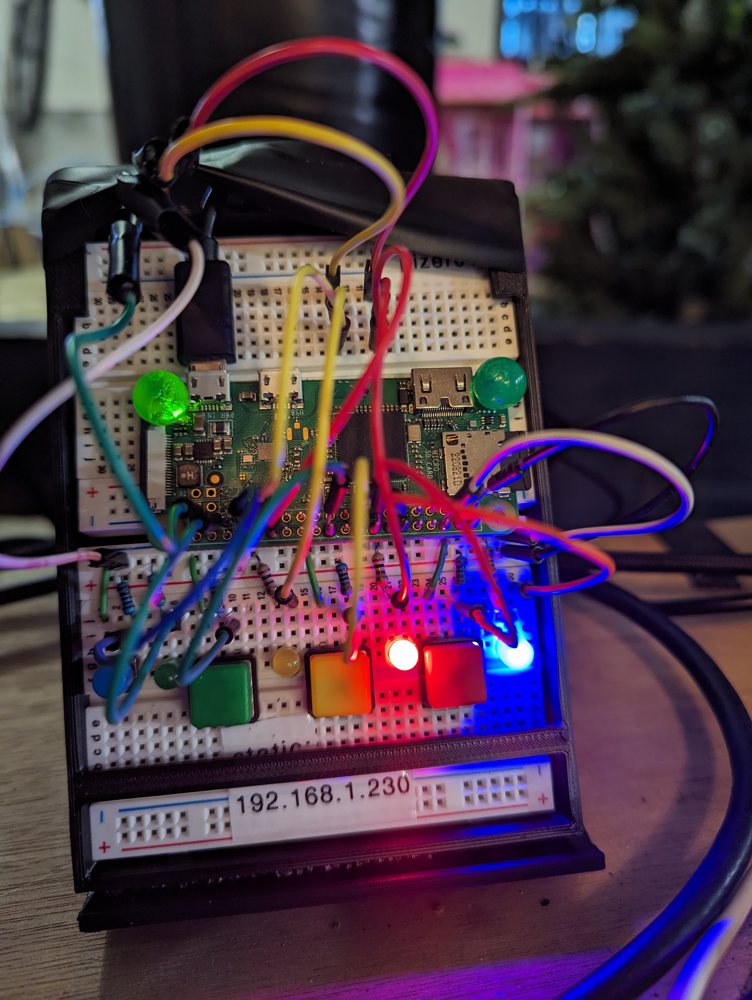

# Office Stoplight

## Project Decription

I work from home, and my workspace also happens to directly attatch to the garage. Because of this, my family often needs access to the garage, but does not know if I can be disturbed. This system will give them a definitive answer, by placing adjustable LEDs on the outside of the office and garage doors.

Please feel free to use everything here to build your own.

## Repo Contents

1. Project Diagram - This is meant to aid in the construction of the circuitry. Please feel free to reach out if you have questions.

2. Code - The "stoplight.py" file listed contains the code to run the program.

3. 3D Models - These contain print casings and mountings for the device.

4. Link to set up your Raspberry Pi zero, and get it running the program on startup: **[Click Here](https://github.com/DavidMiles1925/pi_zero_setup)**

## Diagram

## What the Lights Mean

- **RED:** DO NOT DISTURB
- **YELLOW:** You can come in, but be quiet.
- **GREEN:** Come on in!

## Description and Gallery

**Prototying**

**Main Unit - Final**

**Door Unit - Final**

