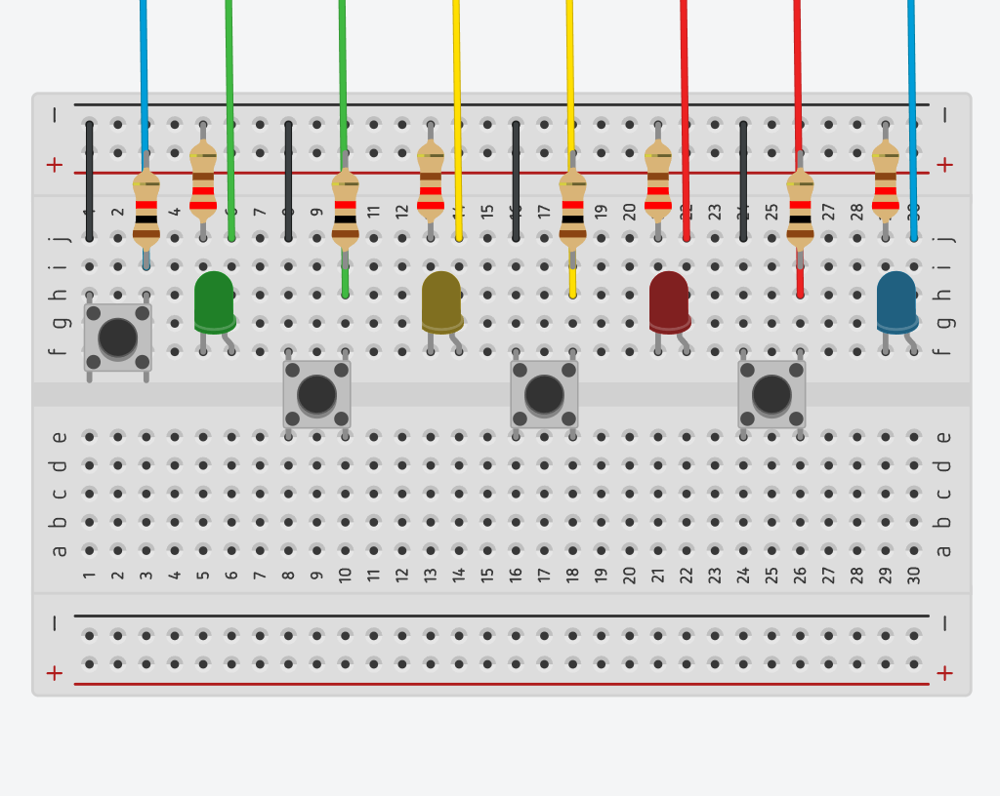
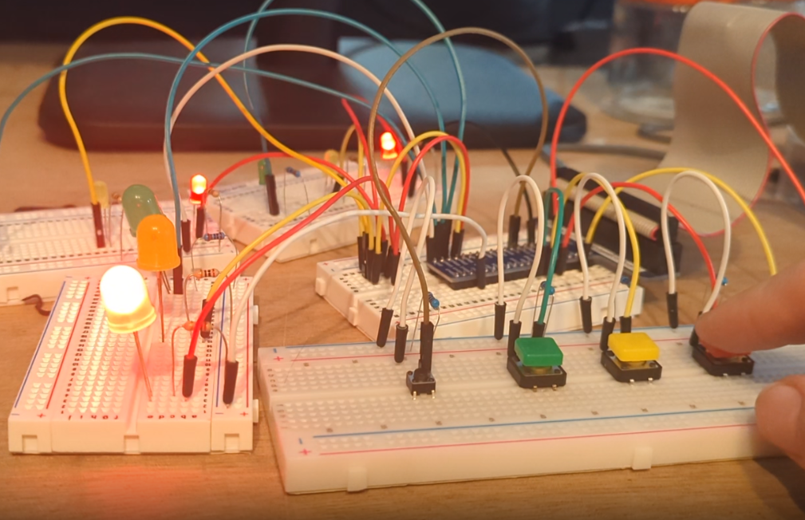
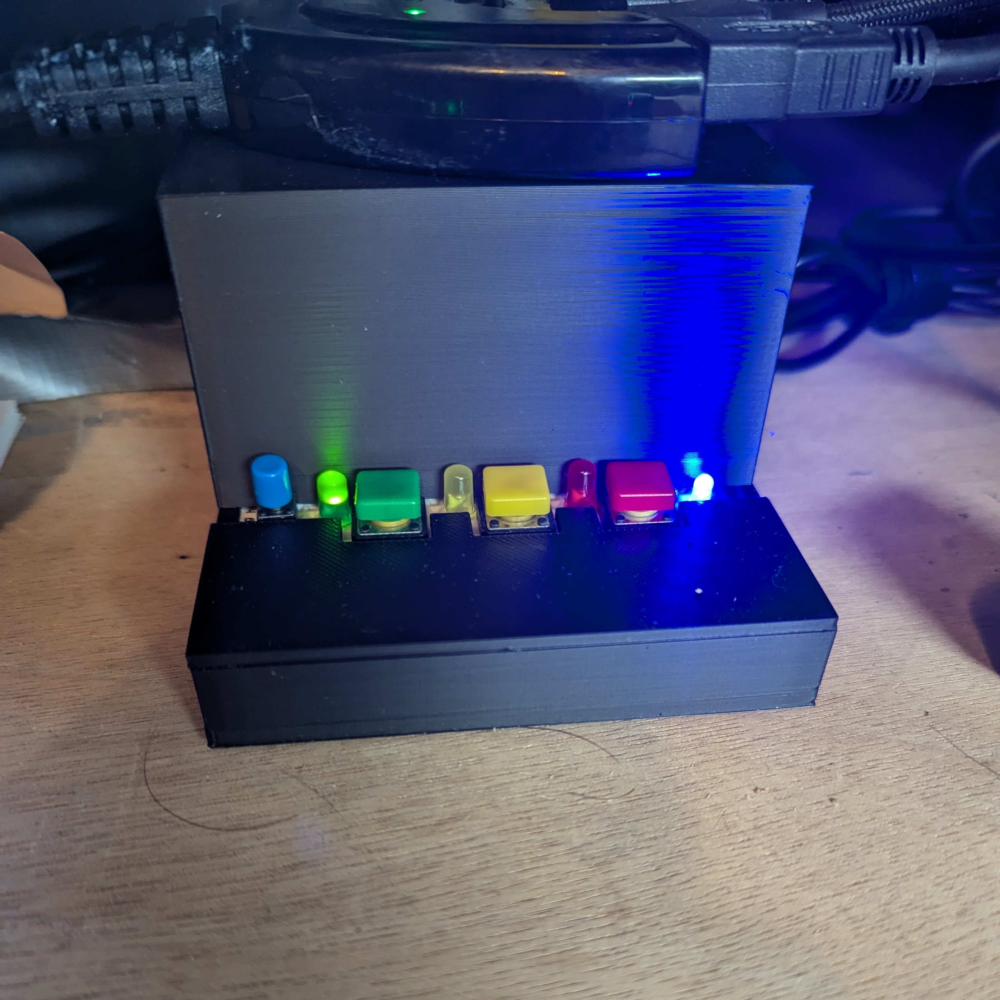
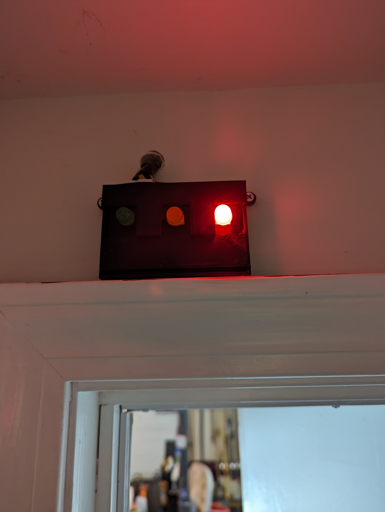

# Office Stoplight


## Project Decription

I work from home, and my workspace also happens to directly attatch to the garage. Because of this, my family often needs access to the garage, but does not know if I can be disturbed. This system will give them a definitive answer, by placing adjustable LEDs on the outside of the office and garage doors.

Please feel free to use everything here to build your own.

## Hardware

### Pre-requisites:

1. You will need to set up a Raspberry Pi. **[Click Here for Instructions](https://github.com/DavidMiles1925/pi_zero_setup)**

### Circuit Diagram

This diagram represents the circuit for the "desK" unit. For the "door" unit, simply omit the buttons.



**Resistor Values**

Value for buttons: 1000 Ohm 
Value for Green and Yellow LED: 147 Ohm
Value for Red: 220 Ohm

### Components List

| Item                 | Quantity | Link        |
| -------------------- | -------- | ----------- |
| Raspberry Pi Zero    | 1        | Microcenter |
| Red LEDs             | 2        | Amazon      |
| Yellow LEDs          | 2        | Amazon      |
| Green LEDs           | 2        | Amazon      |
| BLue LED             | 1        | Amazon      |
| 220 Ohm Resistors    | 6        | Amazon      |
| 12mm Colored Buttons | 3        | Amazon      |
| Two-Prong Button     | 1        | Amazon      |

### Connections

| Purpose                  | Pin (BCM) |
| ------------------------ | --------- |
| Power Indicator          | 17        |
| Red LED - Desk           | 5         |
| Red LED - Hall           | 11        |
| Yellow LED - Desk        | 6         |
| Yellow LED - Hall        | 13        |
| Green LED - Desk         | 26        |
| Green LED - Hall         | 19        |
| Button - Lights OFF      | 12        |
| Button - Red Light ON    | 23        |
| Button - Yellow Light ON | 24        |
| Button - Green Light ON  | 25        |

## Running the Code

**1. Clone the Repo**

```bash
git clone https://github.com/DavidMiles1925/office_stoplight.git
```

**2. Navigate to Program Directory**

```bash
cd office_stoplight.git
```

**3. Test the program**

```bash
sudo python stoplight.py
```

**4. Set to Run on Startup**

```bash
sudo nano /etc/rc.local
```

**Add this to the file `rc.local`. _DO NOT FORGET THE "&"_**

```bash
sudo python /your_pi_name/office_stoplight/stoplight.py &
```

## What the Lights Mean

- **RED:** DO NOT DISTURB
- **YELLOW:** You can come in, but be quiet.
- **GREEN:** Come on in!

## Description and Gallery

**Prototying**



**Main Unit - Final**



**Door Unit - Final**


